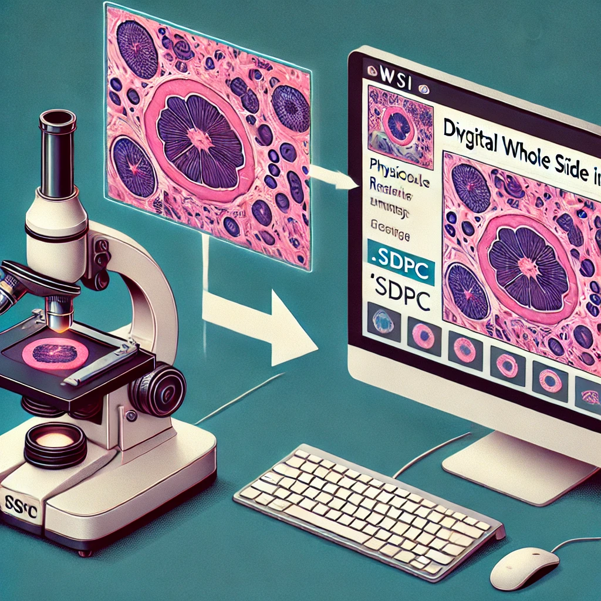
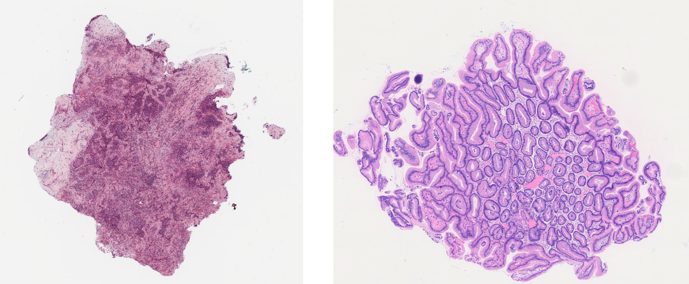

## 🌟opensdpc: library for histopathology whole slide image processing 



<details>
  <summary>Click to expand/collapse previous news.</summary>

### 📚Updating News
#### 🧀 2024.09.27
We have reorganized the previous pipeline and opened a new python library called opensdpc. Here are some of its features:
1. Corrected the usage of some functions in the previous sdpc-for-python and sdpc-linux libraries. Now they are completely aligned with the openslide library. Specifically, the following two contents have been changed: 
  -  `slide.level_dimension` -> `slide.level_dimensions`
  -  `img = Image.fromarray(slide.read_region((cut_x, cut_y), patch_level, (tile_size, tile_size)))` -> `img = slide.read_region((x_start, y_start), args.WSI_level, (x_offset, y_offset)).convert('RGB')`
2. The previous method required changing the environment variables, now it is no longer neccessary to modify them manually
3. The previous sdpc and openslide library have been integrated, now a unified interface is used to call them. Therefore, the opensdpc supports .sdpc and all WSI formats supported by other openslide libraries.

#### 🧀 2024.09.22
1. Some users' machines are not compatible with the latest compiled packages. For this reason, you can still use old versions. See: [old version for sdpc library](https://github.com/WonderLandxD/sdpc-for-python/tree/4c03a32473eb88f24283446c0967e5053f083896).
2. Due to copyright restrictions, I cannot directly provide the software for converting sdpc to svs. I am actively communicating with the company and providing an open source interface. Please contact the slide-scanner after-sales staff to request it. See [sqray.com](https://www.sqray.com/service/scanFilm) for more details.
3. Provide an example for generating patches with multiple thread in order to provide pre-processing for huge datasets. See [this subsection](https://github.com/WonderLandxD/sdpc-for-python/tree/main?tab=readme-ov-file#demo-code-of-using-sdpc-and-openslide-library-to-crop-the-patches).

[Note]
 please use **version==1.5** if you want to use sdpc-linux. I may be slow to reply, thank you for the patience 😊.

If you don't know how to deal with the old version, here is a simple plug-and-play process:
- Step1: Click the [Tsinghua cloud link](https://cloud.tsinghua.edu.cn/f/d1da5598c9c849d98e3f/?dl=1) to download LINUX.zip directly;
- Step2: Replace the unzipped LINUX folder with the LINUX folder of the sdpc package in your own environment;
- Step3: Write the absolute path of the LINUX folder and the ffmpeg folder inside it into the environment variable, see the issue [#2](https://github.com/WonderLandxD/sdpc-for-python/issues/2) for more details
- Step4: Just enter `import sdpc` in python to use it. 

#### 🧀 2024.02.03
1. Updated Part "Troubleshooting"

#### 🧀 2023.12.26
1. **sdpc-linux** and **sdpc-win** are no longer be updated. The latest library **sdpc-for-python** is a new version for Sdpc Python library, which can be used in both Windows and Linux Systems.
2. The color correction has been updated. Now the color of the cropped patches are consistent with the color in the reading software.
3. Changed function name `level_downsample` to `level_downsamples`.
4. Chineses paths have been supported.
5. Added a function to view the magnification directly: `wsi.scan_magnification()`.
6. Added a function to view the sampling ratio directly：`wsi.sampling_rate()`.
7. Added a function of obtaining the thumbnail image: `wsi.get_thumbnail(thumbnail_level)`.
8. The `wsi.crop_patches()` function has been added. Now you can call the function directly in the code to separate the foreground tissue area and crop the patches (Using Pillow Library to save patches).
9. Added a option that can normalize images in `wsi.crop_patches()` function, it normalizes by H and E channels.

</details>


    


### 🔥 Introduction about opensdpc (extended from openslide)

**opensdpc** is a python library for processing whole slide images (WSIs) in **sdpc** format extended form [openslide](https://openslide.org/) library, therefore, opensdpc also supports other common formats such as svs, tiff, ndpi, etc. To read WSIs in **sdpc** format in Windows platform, download the [TEKSQRAY reading software](https://www.sqray.com/Download).

|  Download link | Extraction code | Instruction |
|  ----  | ----  | ----  |
| [Baidu Cloud](https://pan.baidu.com/s/1A4oOSlS2pCTsSRmQ_eCljQ)  | sq12 | Lite version |
| Please see the [sqray.com](https://www.sqray.com/Download) | - | Full version |

### 🎈Installation
There are several versions available. We **recommend** Linux users to use the **opensdpc** version.

#### 🌟 opensdpc (recommend for Linux users) 🌟

-  [Optional] install openslide library on Linux (same as openslide)

    ```
    apt install openslide-tools
    pip install openslide-python
    ```
    **If your system has already install the openslide-tools and openslide-python, you can skip this step.**
-  [Optional] install opensdpc-tools

    ```
    wget --content-disposition https://cloud.tsinghua.edu.cn/f/9077d5abb17a4f10b7d6/?dl=1
    dpkg -i opensdpc-tools_1.0-1_all.deb
    ```
    You can also download this tool from [Tsinghua Cloud](https://cloud.tsinghua.edu.cn/f/9077d5abb17a4f10b7d6/?dl=1). If you want to remove it, `sudo dpkg -P opensdpc-tools`. \
    **[Note]: the installation of opensdpc-tools requires root permission, so you need to use `sudo -i` to install it. If your system has already install the opensdpc-tools, you can skip this step.**

-  install opensdpc library

    ```
    pip install opensdpc
    ```
    After this operation, the opensdpc installation is complete.
  
Some users have no sudo permission on their Linux system. In this case, you can git clone this repository first by `git clone https://github.com/WonderLandxD/opensdpc.git`, then refer to the following steps to add the opensdpc environment variable:
```
vim ~/.bashrc
export LD_LIBRARY_PATH=$LD_LIBRARY_PATH:/<repository_path>/LINUX/:/<repository_path>/LINUX/ffmpeg/
source ~/.bashrc
```

After this operation, you can also import opensdpc library in your python code.

<details>
  <summary>Other libraries</summary>

#### 🌟 sdpc-win (for windows users **only**) 🌟
- install sdpc-win library

    ```
    pip install sdpc-win
    ```
    After this operation, the sdpc-win installation is complete.

#### 🙁 sdpc-for-python (not recommended, higher ubuntu systems are required) 🙁
- install sdpc-for-python library

    ```
    pip install sdpc-for-python
    ```
    After this operation, the sdpc-for-python installation is complete.

#### 🙁 sdpc-linux (not recommended, some bug are need to fixed manually) 🙁
- install sdpc-linux library

    ```
    pip install sdpc-linux==1.5
    ```
    After this operation, the sdpc-linux installation is complete.

</details>
<!-- |  Platform   |  PyPI installer |
|  ----  | ----  |
| Windows/Linux  | `pip install sdpc-for-python` | -->


### 🚀 Basic usage
There are two example WSIs in the `data` folder, which are in the **sdpc** format and **svs** format (download from [CLAM](https://github.com/mahmoodlab/CLAM/blob/master/heatmaps/demo/slides/C3L-01663-21.svs)) respectively. 



We will use the **sdpc** format WSI as an example to demonstrate how to use basic functions of opensdpc.

```
import opensdpc

slide = opensdpc.OpenSdpc('data/20220514_145829_0.sdpc') # load the WSI

print(f'This WSI have {slide.level_count} levels.') # the number of levels

print(f'The magnification of this WSI is {slide.scan_magnification}x.') # the magnification of the WSI

print(f'The downsampling ratio of this WSI is {slide.sampling_rate}.') # the downsampling ratio of the WSI

print(f'The downsample ratio of each level is {slide.level_downsamples}.') # the downsample ratio of each level

print(f'The dimensions of each level is {slide.level_dimensions}.') # the dimensions of each level

thumbnail = slide.get_thumbnail(3) # get the thumbnail of the WSI
print(f'The thumbnail (level 3) shape is {thumbnail.shape}.') # the shape of the thumbnail
```

you will see the result like this:
```
This WSI have 4 levels.
The magnification of this WSI is 40x.
The downsampling ratio of this WSI is 0.25.
The downsample ratio of each level is (1.0, 4.0, 16.0, 64.0).
The dimensions of each level is ((26880, 21504), (6720, 5376), (1680, 1344), (420, 336)).
The thumbnail (level 3) shape is (336, 420, 3).
```

### 🚉 Generate the patches

We provide a demo file to show how to generate the patches from the WSI. See [generate_demo.ipynb](data/generate_demo.ipynb) for more details. **Note: when using .ipynb file at the first time, you need install the opensdpc library using pip in Jupyter Notebook, jump to [here](data/generate_demo.ipynb) to see how to do it.**


*Jiawen Li, H&G Pathology AI Research Team*
